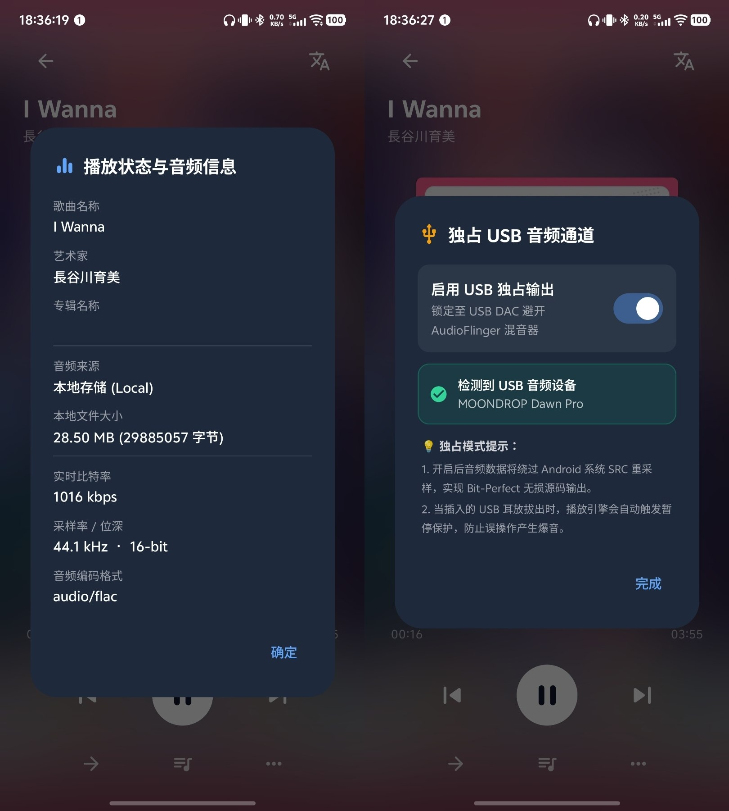
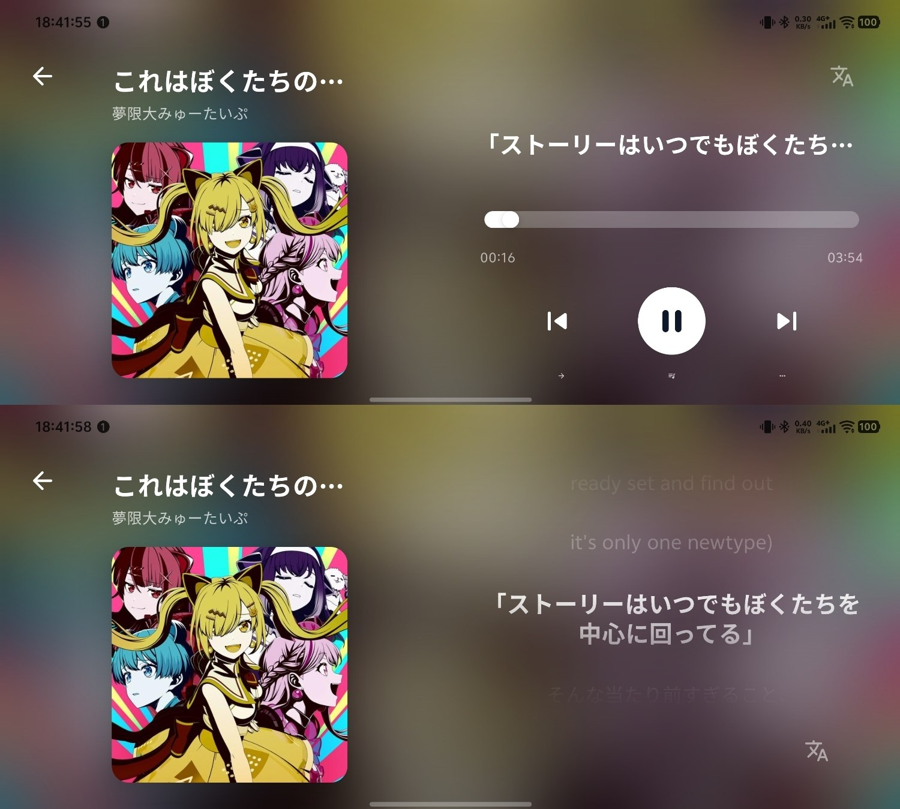
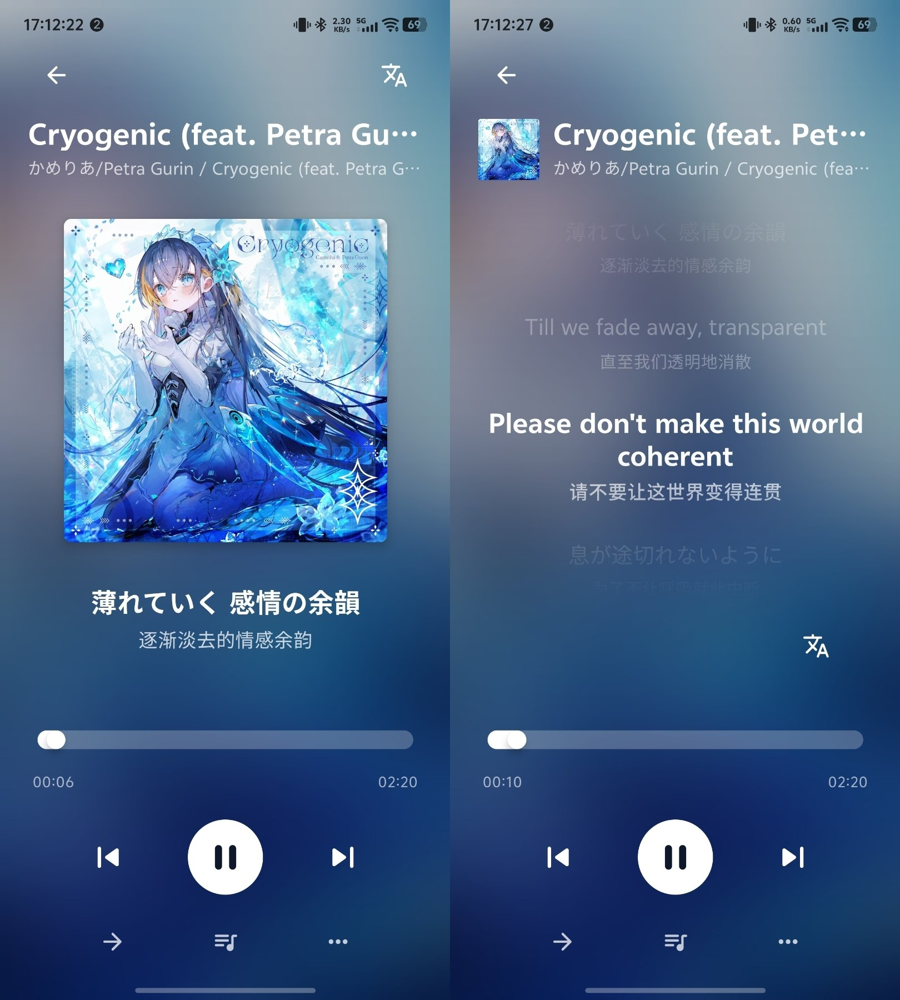
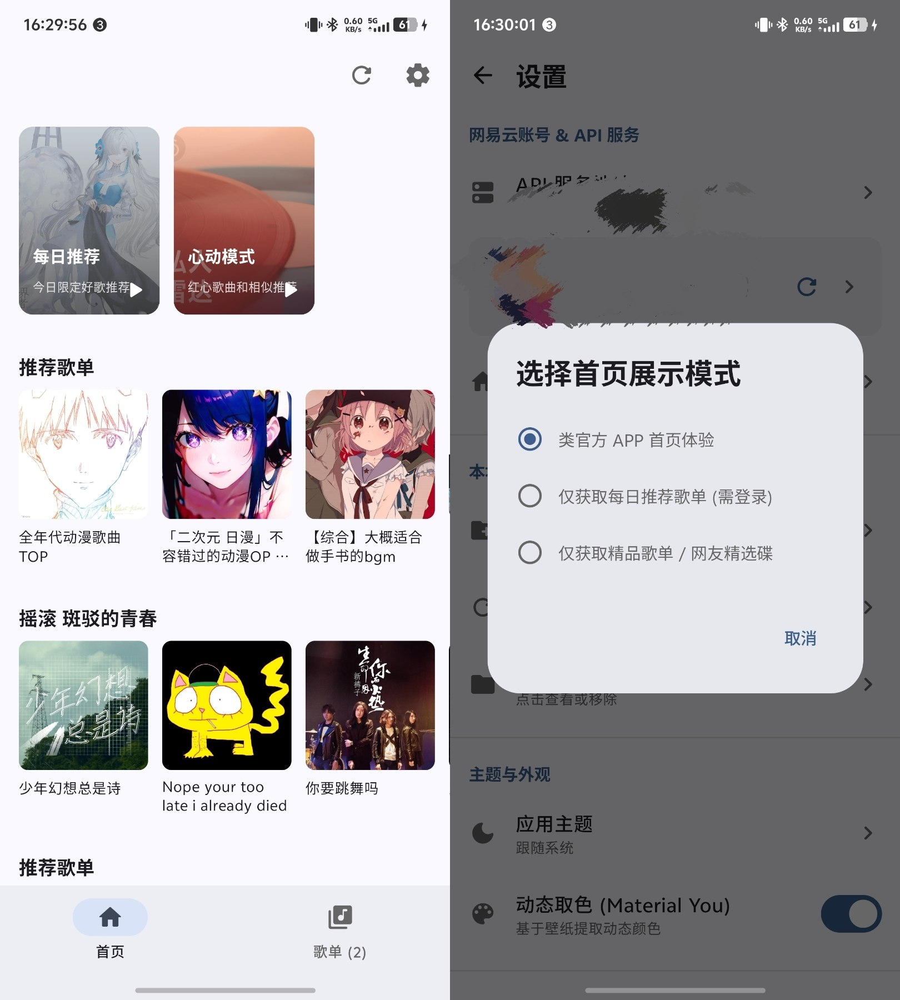
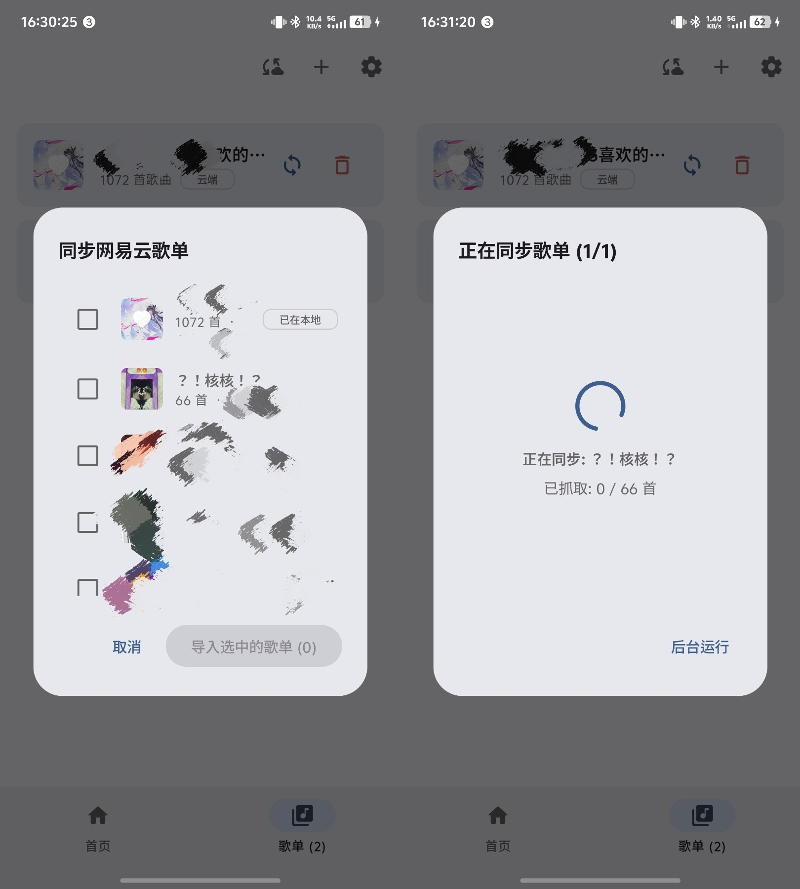
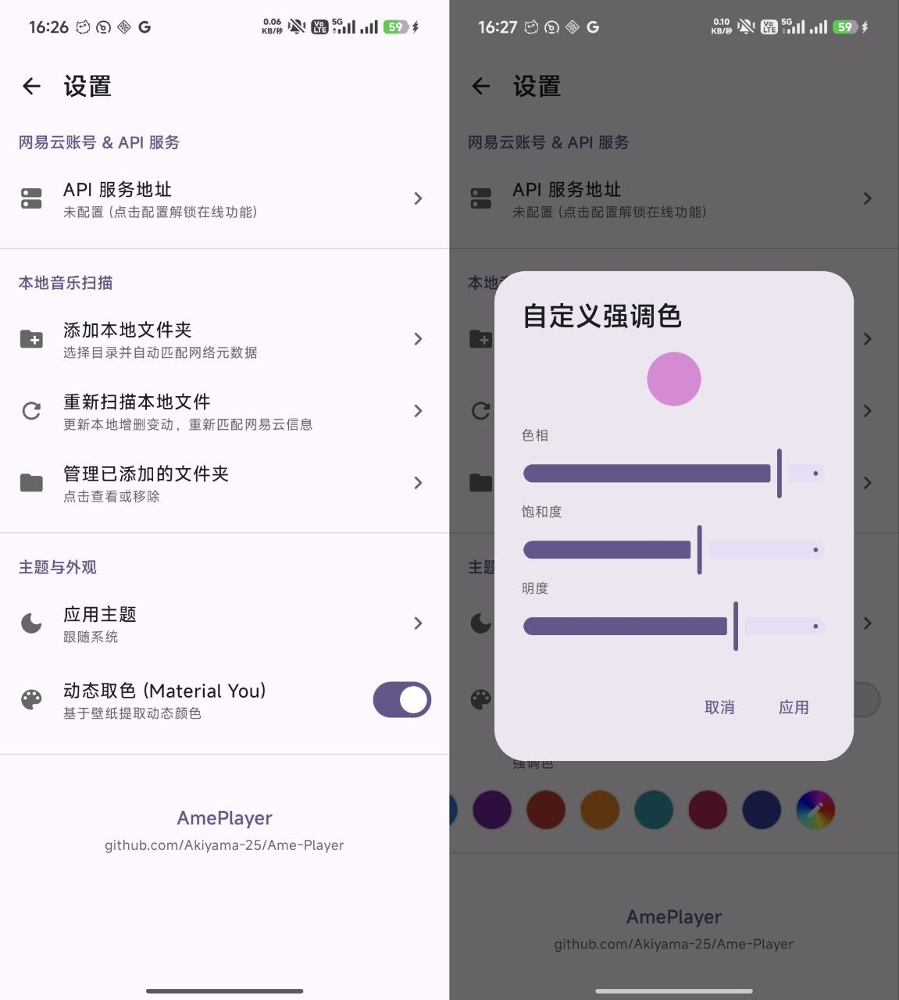
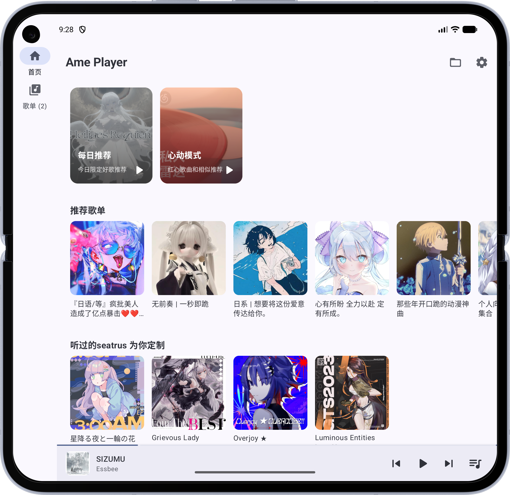
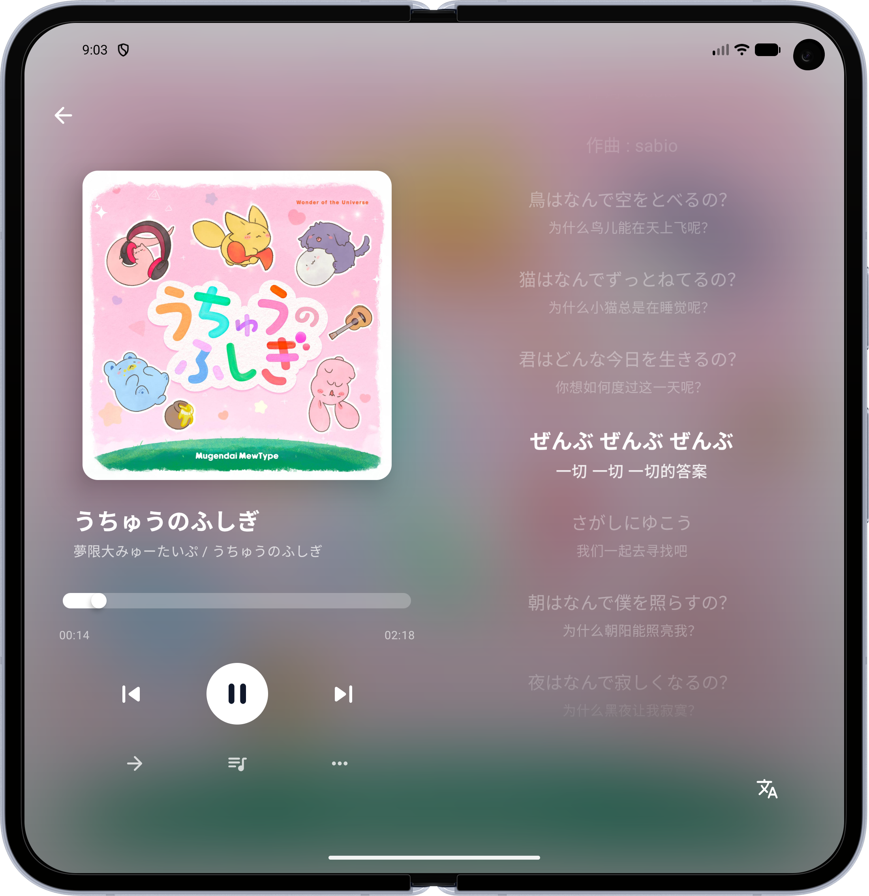

<div align="center">
  
  <h1>AmePlayer</h1>
  <p>基于 Jetpack Compose 与 Media3 (ExoPlayer) 构建的高品质 Android 音乐播放器，支持网易云音乐在线播放、本地音频管理与 NCM 加密文件解密，深度集成 Material 3 Adaptive 自适应布局与 USB DAC 硬件直通输出。</p>
</div>

<p align="center">
  
  
  
  
</p>
<p align="center">
  
  
  
  
</p>

---

## 目录

- [项目简介](#项目简介)
- [功能概览](#功能概览)
- [架构与模块](#架构与模块)
- [环境要求](#环境要求)
- [构建与运行](#构建与运行)
- [本地与云端匹配机制](#本地与云端匹配机制)
- [技术栈](#技术栈)
- [鸣谢](#鸣谢)
- [许可声明](#许可声明)

---

## 项目简介

AmePlayer 是一款面向 Android 平台的音乐播放器应用。项目以「高保真音频播放」与「网易云音乐生态深度整合」为核心定位，旨在为用户提供兼具本地与在线的一站式音乐体验。

主要设计目标：

- **跨设备自适应**：借助 Material 3 Adaptive Navigation Suite，在手机竖屏、横屏、折叠屏及平板等不同形态下自动切换最佳导航与布局方案。
- **发烧级音频直通**：内置 USB DAC 独占模式，绕过 Android AudioFlinger 重采样链路，实现 Bit-Perfect 原始码流输出。
- **网易云全链路整合**：通过扫码登录账户，双向同步云端歌单与"我喜欢的音乐"，自动协商并获取当前账户权限所允许的最高音质（Hi-Res / 无损 / 高品质）。
- **NCM 格式兼容**：支持解密网易云客户端下载的 `.ncm` 加密音频文件，并自动通过 API 补全缺失的元数据信息。

---

## 功能概览

### 播放引擎与音频

| 功能 | 说明 |
|------|------|
| 在线流媒体播放 | 解析网易云 CDN 真实 MP3/FLAC 播放链接，自动重试最高音质（`hires` → `lossless` → `exhigh` → `standard`） |
| 本地音频播放 | 支持通过系统文件选择器选取多个本地目录进行批量扫描 |
| NCM 文件解密 | 自动识别并解密 `.ncm` 格式加密文件，缺失元数据时通过 API 兜底补全 |
| USB DAC 独占直通 | 绕过 AudioFlinger SRC 重采样，实现 Bit-Perfect 输出；设备拔出时自动暂停保护 |
| 智能歌词匹配 | 根据音频元数据检索网易云曲库，拉取双语同步歌词 |

### 网易云音乐集成

| 功能 | 登录要求 |
|------|----------|
| 扫码授权登录 | — |
| 用户信息获取与刷新（昵称、头像、VIP 等级） | 需登录 |
| 云端歌单同步（拉取用户创建和收藏的歌单） | 需登录 |
| 歌单曲目双向同步（本地增删操作实时同步至云端） | 需登录 |
| 喜欢 / 取消喜欢（红心同步） | 需登录 |
| 每日推荐歌曲与歌单 | 需登录 |
| 首页推荐聚合（Dragon Ball 入口 + Block 混合推荐 + 精品歌单） | 部分功能需登录 |

### 界面与交互

- **Material 3 Adaptive 自适应导航**：基于 `NavigationSuiteScaffold`，紧凑屏幕（< 600dp）使用底部 `NavigationBar`，中等及以上屏幕（≥ 600dp）切换为左侧 `NavigationRail`。
- **响应式首页网格布局**：使用 `GridCells.Adaptive` 根据窗口断点动态调整列数（Compact 2-3 列 / Medium 4-5 列 / Expanded 6-8 列），卡片尺寸随断点自动缩放。
- **全局过渡动画**：基于 Compose `AnimatedContent` 实现页面间平滑过渡，包括播放页上拉/下拉、设置页侧滑、Tab 交叉淡入淡出及歌单详情景深推进等。
- **Material You 动态主题**：完整适配 Monet 引擎的系统取色；关闭动态取色时自动捕获并固化当前系统色调，内置 HSV 调色盘供手动指定。
- **歌曲操作菜单**：通过底部弹出面板（Bottom Sheet）提供"下一首播放"、"喜欢/取消喜欢"、"加入/移出歌单"等操作，操作结果实时同步至云端。

---

## 架构与模块

项目采用单模块结构，包名为 `Akari.NCM.player`，按职责划分为以下子包：

```
app/src/main/java/Akari/NCM/player/
├── api/          # 网易云 API 服务层（NcmApi，基于 Ktor Client）
├── core/         # 通用工具类与扩展函数
├── data/         # 数据持久化与歌单管理（PlaylistManager）
├── di/           # Hilt 依赖注入模块
├── player/       # 音频播放引擎（AmePlayerEngine，Media3 集成）
└── ui/           # Compose UI 层（各页面、组件与主题）
```

---

## 环境要求

| 项目 | 版本要求 |
|------|----------|
| Android Studio | Ladybug (2024.2) 或更高版本 |
| JDK | 21 |
| Gradle | 9.5 |
| Android compileSdk | 37 |
| Android minSdk | 26 (Android 8.0) |
| Android targetSdk | 35 |
| Kotlin | 与 Compose Compiler 插件对应版本 |

此外，在线功能依赖自行部署的 [NeteaseCloudMusicApi Enhanced](https://github.com/NeteaseCloudMusicApiEnhanced/api-enhanced) 服务端实例。

---

## 构建与运行

1. 克隆仓库：
   ```bash
   git clone https://github.com/Akiyama-25/Ame-Player.git
   cd Ame-Player
   ```

2. 在 `local.properties` 中配置 Android SDK 路径（通常由 Android Studio 自动生成）。

3. 使用 Android Studio 打开项目，等待 Gradle 同步完成后，选择目标设备并点击 **Run** 即可。

4. 命令行构建：
   ```bash
   ./gradlew assembleDebug
   ```

---

## 本地与云端匹配机制

应用在加载云端歌单时，会自动与「本地扫描文件夹」中已索引的音频进行匹配。匹配成功的曲目将在歌单中显示本地标记（✓），播放时优先读取本地文件以减少流量消耗并降低加载延迟。

### 匹配策略

1. **精确 ID 匹配**：含有 `musicId` 元数据的 NCM 文件通过唯一 ID 直接关联。
2. **文本特征匹配（Fallback）**：对于普通 MP3/FLAC 文件，提取 ID3 标签中的 `"歌名 - 歌手"` 并转换为小写后进行交叉比对。若本地文件缺失 ID3 标签，则尝试以文件名通过网易云 API 进行搜索匹配。

### 已知边缘情况

| 场景 | 说明 |
|------|------|
| 多歌手分隔符不一致 | 云端通常以 `/` 拼接（如 `A / B`），本地可能使用 `,` 或仅标注主唱，导致文本不匹配 |
| 歌名附加后缀差异 | 云端歌名携带 `(Live)`、`(Remaster)`、`(feat. xxx)` 等后缀而本地标签无此信息 |
| 全角/半角字符与标点差异 | 直角引号与弯角引号（`'` / `'`）、中英文括号（`()` / `（）`）及简繁体差异均可能阻断匹配 |
| 无标签文件的 API 兜底误判 | 文件名不规范时（如 `track_01.mp3`），API 搜索可能返回错误结果，导致误匹配 |
| 同名曲目覆盖 | 同时存在原唱与伴奏且 ID3 标签完全相同时，后扫描的文件将覆盖前者的映射关系 |
| MPEG/MP3 本地翻唱与电台曲目 | 当本地音频为网易云电台、播客或未官方收录的翻唱时，基于官方单曲库的 API 搜索会匹配失败，此时将退回提取本地 ID3 封面，且可能无法获取到正确的歌词 |

---

## 技术栈

### UI 与界面框架
- Jetpack Compose（声明式 UI）
- Material 3 + Material 3 Adaptive Navigation Suite
- Coil（图片异步加载）

### 多媒体引擎
- AndroidX Media3 (ExoPlayer)
- ResolvingDataSource（在线 URL 拦截与解析）

### 网络与序列化
- Ktor Client (OkHttp 引擎)
- Kotlinx.Serialization (JSON)

### 依赖注入
- Hilt + KSP

### 异步与并发
- Kotlin Coroutines & Flow

### 测试
- Robolectric（本地 JVM 环境下的 Compose UI 自动化测试）
- AndroidX Compose UI Test (JUnit 4)
- Pixel 10 Pro Fold JVM (SDK 37)

---

## 鸣谢

- **[NeteaseCloudMusicApi Enhanced](https://github.com/NeteaseCloudMusicApiEnhanced/api-enhanced)** — 提供网易云音乐 API 服务封装，本项目的云端交互、音轨解析及账号能力依赖于该开源项目。
- **应用图标来源** — [kanae3792 (Pinterest)](https://jp.pinterest.com/kanae3792/)

---

## 许可声明

本项目仅供技术学习与交流使用，请勿用于任何商业用途。

**项目地址**：[https://github.com/Akiyama-25/Ame-Player](https://github.com/Akiyama-25/Ame-Player)
